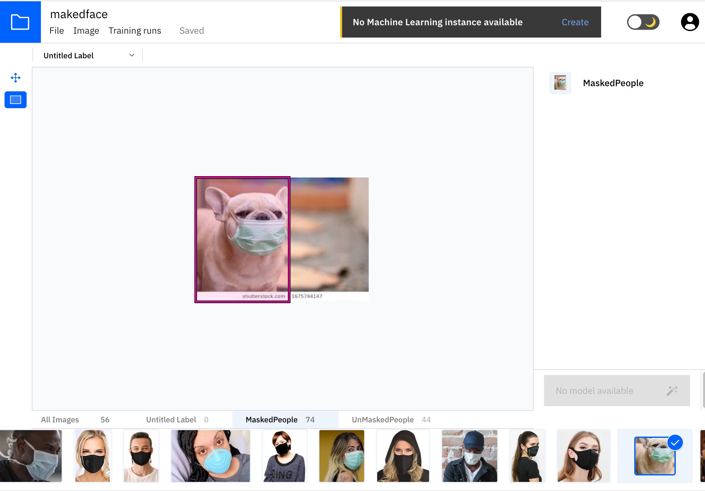
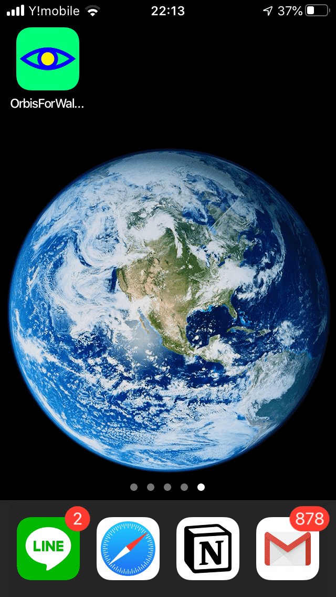
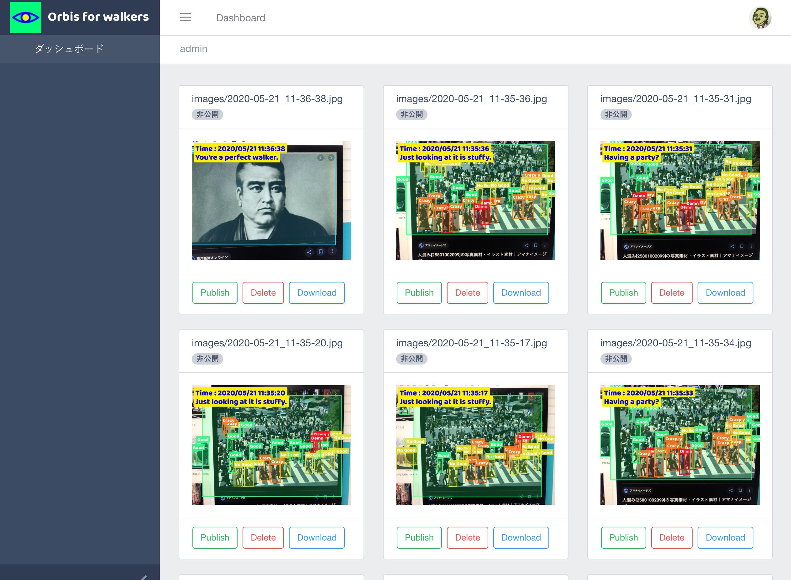
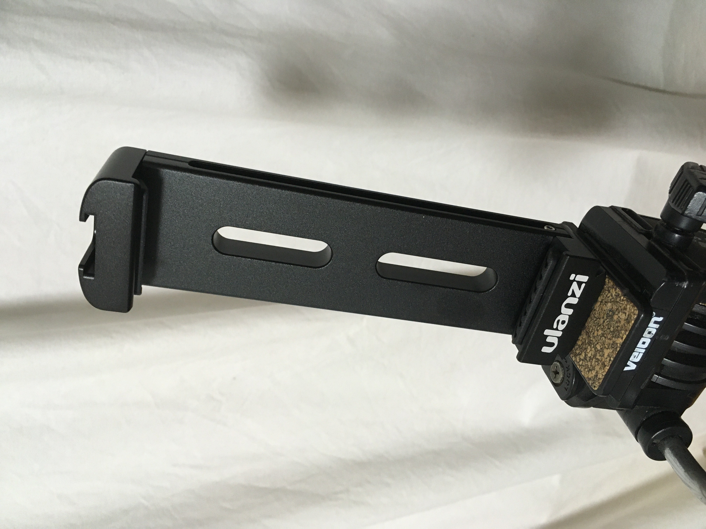
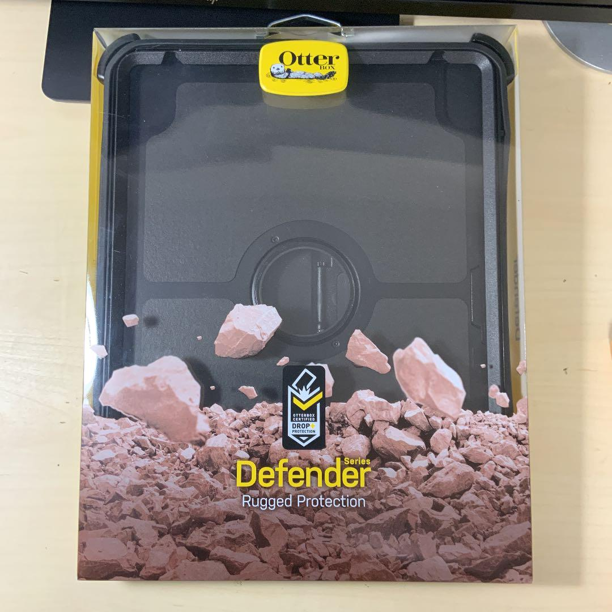

# 密違反監視カメラ作った。（Vue + Firebase + Vision (iOS framework) ）
やぁ、やぁ、自粛解禁ムードになってきてみなさん油断していないですかね？
そんな悪い子たちのために密違反監視カメラ作りやした。        
iOSのアプリで人の密度を判定するアプリを作って、     
そのライブ映像を見れるサイトを作りました。      

コンセプトは車のスピード違反取締りのオービスみたいな感じで、    
人が密度違反をしていたら、写真を撮ってしまうぞ！    
という怖い監視カメラです。  

ライブ映像はこちらから見れます。    
https://orbisforwalkers.tokyo

---
## 背景
コロナ便乗 創作欲求満たすぜ大喜利と言われたら反論はできない。   
コロナ禍の中で、一線の研究者達が世界のために日々闘う姿をみて感動し、凡人である我々に何ができるのか考えた時に、とにかく何か作らなければと使命に駆られた....    
という理由で開発したのならもう少し格好がつくのだがそういう理由ではない。  

大それたことは関係なしに、何か感じて作るという自然なことを日々やっていかなければと考えていた矢先に、  
コロナになったのでいつの間にかこういうプロダクトが出来てしまった。という感じだ。Gomenn...    

今回のプロダクト制作の目的は大きく分けると二つで、  

 - 考えた物をチームで形にしていく練習    
 - 興味分野の技術習得 (技術習得のトピックは以下)
    - firebase使えるようにならんとなぁと思ってた事。（ライブ演出仕事とかインスタレーションの仕事が減るかも）    
    - 最近仕事でインスタレーションを開発した際に人体検知の機械学習に触れた事 -> なにか使えるのでは？    
    - 動画配信系の勉強せんとなぁと思ってた事。  

これらの目的を達成したら出来てしまったという流れ.

Orbis for walkersはコロナ警察を助長するようなプロダクトであるため微妙な雰囲気はあるのだが、外出自重しろよ！！という意図ではなく、   
こういうのを既存の技術で割とサクッと作れてしまうんだぞ、という事の周知としてみてもらえればと思う。  
これに個人情報をくっつければ、密スコアが高い人間は逮捕といったデストピアが想像できる。  
デザインは[kiki](https://www.instagram.com/kikigawa/?hl=en)が笑える感じにしてくれた。

---

## システム構成

iOSアプリで人体検知、密スコア判定   
密スコアが閾値を超えたら、画像をfirebaseに投げる。  
管理画面で良く撮れた画像をパブリッシュすると、サイトに表示。    
ついでに、iOSアプリで密判定を描画している様子をlive配信。     
という感じのフローだ。

---
## iOS アプリ
最近仕事で使った人体検知はwindows環境でpythonだったのだが、             
アプリでサクッとみんな出来た方が楽しい説 + windows PC買う予算ない           
ということでiOS環境で試すことにした。       
CoreMLの勉強と思っていたが結局自作モデルは使わなかったが、        
ほんと今更だけど、こんな簡単に学習モデルを用意出来てしまうとは思わなかった。時代についていけていなかった。      

CreateMLでObject Detecitonの学習モデルを作りたい場合annotations.jsonをどうやって用意するか不明だったが、    
IBMのCloud Annotations Toolで作れた。   
[Cloud Annotations Tool](https://cloud.annotations.ai/login)  

こんな感じで、この画像のどの範囲にマスク野郎がいるかを決めてラベルを割り当てる作業をする。    
こちらに詳しくやり方書いてあるので参考に  
[How to Label Data — Create ML for Object Detection | hackernoon](https://hackernoon.com/how-to-label-data-create-ml-for-object-detection-82043957b5cb)

で、エクスポートしたデータをcreateMLに突っ込んで学習させれば、モデルデータが完成する。  
コードは一行も書かない。すごい！！  
ちなみに学習は数時間かかる。雑魚macだと他の作業出来なくなるので夜寝る前に開始して寝よう。   

そして出来たデータは以下の公式apple developerのリンク先からダウンロードできるコードで使える。   
[Recognizing Objects in Live Capture](https://developer.apple.com/documentation/vision/recognizing_objects_in_live_capture)

このコードを参考にfirebase周り入れてゴニョゴニョして完成。  
やっぱり自作アプリが自分のiPhoneとかに入ると嬉しいね！      
      
チーム内での配信はdeploygateで行った。      
どうでもよいが数年振りにiosのアプリ開発したけどまだcocoapodがスタンダードなのだろうか？firebaseの公式もcocoapodで入れるの推奨してた。     

---
## 管理画面

管理画面はこんな感じ。      
vueでwebpack構成SPA。普通です。       
フレームワークはbootstrap制のcoreUIを使いました     
[https://coreui.io/vue/](https://coreui.io/vue/)

---
## Firebase
firebase初心者だったので、firebaseというかfirestoreの勉強は以下の書籍で行った。      
[実践Firestore (技術の泉シリーズ（NextPublishing）) Kindle版](https://www.amazon.co.jp/%E5%AE%9F%E8%B7%B5Firestore-%E6%8A%80%E8%A1%93%E3%81%AE%E6%B3%89%E3%82%B7%E3%83%AA%E3%83%BC%E3%82%BA%EF%BC%88NextPublishing%EF%BC%89-%E7%A6%8F%E7%94%B0-%E9%9B%84%E8%B2%B4-ebook/dp/B0851BGDQG/ref=sr_1_1?__mk_ja_JP=%E3%82%AB%E3%82%BF%E3%82%AB%E3%83%8A&dchild=1&keywords=firebase+firestore&qid=1590067868&sr=8-1)    

RDBに少し慣れてるとfirestoreでのデータ構造やコレクションの設計どうするかとか謎だったが、    
この本読んで色々すっきりしました。mysqlとかいじったことある人がfirestoreなんぞ？の時はこれがベストな気がする。      
あとちょっと古いけどmonoさんの記事とか。        
[Cloud Firestoreの勘所 パート1 — 概要](https://medium.com/google-cloud-jp/firestore1-a62405a7cd82)      
皆様ありがとうございました。  

---
## 現場
iPad proを三脚に固定するマウント。

ipad防御するカバー。
Otterbox defenderのiPad pro12.9用。重くてデカイしかも高い1万円以上する。普通は絶対買わない。

三脚に立てる用のipadマウント

5/22(金)の午後は街を撮影しながらlive配信でもしようかと思っている。  
どうぞよろしく。

---